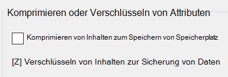

# Verschlüsseln von Dateien oder Ordnern unter Windows 10Encrypt files or folder in Windows 10

Ein gesamtes Laufwerk können Sie mit BitLocker verschlüsseln. Einzelne Dateien oder Ordner (und deren Inhalte) verschlüsseln Sie folgendermaßen:You can encrypt an entire disk using BitLocker, but to encrypt only individual files or folders (and their contents):

1. Wählen Sie im **Datei-Explorer** die/den Datei(en)/Ordner aus, die/den Sie verschlüsseln möchten.In **File Explorer**, select the file(s)/folder(s) you want to encrypt. In diesem Beispiel wurden zwei Dateien ausgewählt:In this example, two files have been selected:

    

2. Klicken Sie mit der rechten Maustaste auf die ausgewählten Dateien und klicken Sie anschließend auf **Eigenschaften**.Right-click the selected files and click **Properties**.

3. Klicken Sie im Dialogfenster **Eigenschaften** auf **Erweitert**.In the **Properties** window, click **Advanced**.

4. Aktivieren Sie im Dialogfenster **Erweiterte Eigenschaften** das Kontrollkästchen **Inhalte zum Schutz der Daten verschlüsseln**:In the **Advanced Properties** window, select the **Encrypt contents to secure data** checkbox:

    

5. Klicken Sie auf **OK**.Click **OK**.
